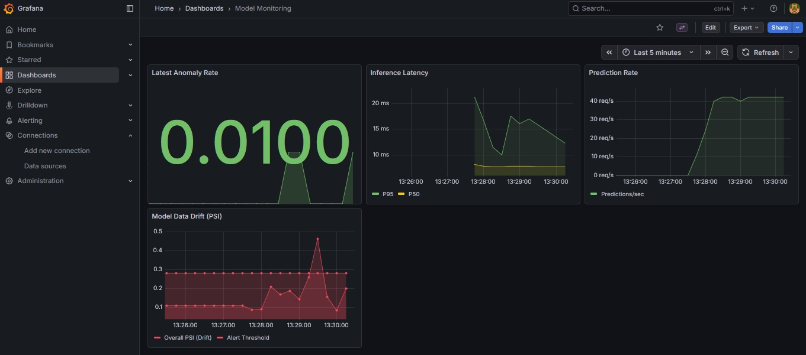
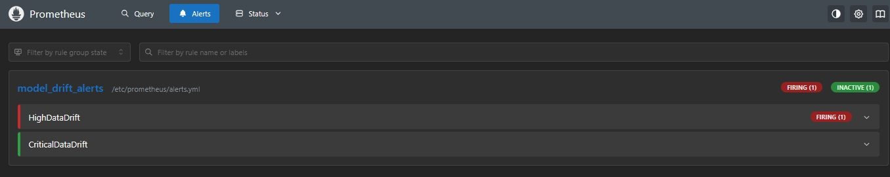

# Production-Grade Anomaly Detection MLOps Pipeline

A complete MLOps system demonstrating experiment tracking, model deployment, drift detection, and automated monitoring in production.

**Project Focus:** This is an **MLOps engineering focused project**, not model optimization. The emphasis is on building production-ready infrastructure with proper monitoring, drift detection, and CI/CD automation.

## Production-Ready Architecture

- ✅ Containerized model serving with health checks
- ✅ Real-time metrics collection (Prometheus + Grafana)
- ✅ Data drift detection (PSI)
- ✅ Automated alerts and backtracking
- ✅ CI/CD pipeline with automated testing

---

## Architecture & Project Structure
**Dataset:** Credit Card Fraud Detection (Kaggle)
**Models:** Isolation Forest vs Autoencoder
**Stack:** MLflow, FastAPI, Docker, Prometheus, Grafana, GitHub Actions

The project follows a modular design to separate data concerns from training and serving logic:

* `src/prepare_data.py`: splits data using time-based splits (reference-val-untouched)
	* The dataset used is Credit Card Fraud Detection from Kaggle
	* Raw data is located in `data/raw/`
* `src/training.py`: trains, evaluates, and logs the models.
* `src/utils/register_model.py`: registers the best model based on the given metric.
* `src/utils/export_model.py`: loads and shifts the best model registered in mlflow.db to serve folder


Key folder structure:
```
├── src/
│   ├── prepare_data.py
│   ├── training.py
│   └── utils/
│       ├── register_model.py
│       └── export_model.py
│   └── drift/
│       └── detector.py
├── serve/
│   ├── app.py
│   └── Dockerfile.prod      # Production container
├── scripts/
│   ├── batch_processor.py   # Batch inference with drift detection
│   └── generate_mixed_load.py # Load testing
├── monitoring/
│   ├── prometheus.yml       # Metrics collection config
│   └── alerts.yml           # Drift & latency alerting rules
└── .github/workflows/       # CI/CD automation
```


---

## Getting Started

### Environment Setup

This project uses dev container with VSCode for development (.devcontainer folder).
```
code .

# or

devpod up .
```

### 1. Data Preparation & Training

The pipeline splits the raw dataset into a **Reference** set (for training) and **10 sequential batches** to simulate streaming production data.

```
# Prepare data
python src/prepare_data.py

# Run training (logs to MLflow)
python src/training.py

# Register model
python src/utils/register_model.py

# Shift best model for deployment
python src/utils/export_model.py

# Test locally
python -m uvicorn serve.app:app --port 8000
```

### 2. Local Model Serving


```bash
# Test API locally
python -m uvicorn serve.app:app --port 8000

# Health check
curl http://localhost:8000/health
```

### 3. Production Deployment


```bash
# Build & run container
docker build -t anomaly-detection:v1 -f serve/Dockerfile.prod .
docker run -p 8000:8000 anomaly-detection:v1
```

### 4. Full Monitoring Stack

```bash
# Start Prometheus + Grafana + API
docker-compose up -d

# Simulate production traffic
python scripts/generate_mixed_load.py
```

### 5. End-to-end deployment
```bash
./train_to_deploy.sh
```

``````


## API Usage

The model accepts a list of features and returns the prediction (`1` for anomaly, `0` for normal) along with its anomaly score and inference metadata.

### 1. Single sample test
**Example Request:**
```
curl -X POST http://IP_ADDRESS:8000/predict \
 -H "Content-Type: application/json" \
 -d '{ "features": [
		[0.1, 0.2, 0.3, 0.4, 0.5, 0.6, 0.7, 0.8, 0.9, 1.0,
		 0.1, 0.2, 0.3, 0.4, 0.5, 0.6, 0.7, 0.8, 0.9, 1.0,
		  0.1, 0.2, 0.3, 0.4, 0.5, 0.6, 0.7, 0.8, 0.9]
		]
	 }'
# 29 features in total
```

**Example Response:**

JSON

```
{
  "predictions": [1],
  "anomaly_scores": [1.0],
  "model_version": "baked-in",
  "inference_time_ms": 9.39
}
```

---
### 2. Batch sample test and monitoring
(same as 1-4)
```bash
# Start Prometheus + Grafana + API
docker-compose up -d

# Simulate production traffic
python scripts/generate_mixed_load.py

``````

### 3. Backtrack predictions
``` Bash
# Find which batches had drift
grep "batch_00" logs/predictions.jsonl | jq 'select(.psi_score > 0.3)'

# See last 20 predictions
curl "http://localhost:8000/predictions/recent?limit=20" | jq
```

## Monitoring & Drift Detection

### Implemented Metrics

- **Model Performance:** Anomaly rate over time
- **System Health:** Inference latency (p50/p95), resource usage
- **Data Quality:** Feature-level drift (PSI)

### Alerting Rules
-  Drift detection: PSI > 0.28


## Roadmap

- [x] **Phase 1-3:** Data batching, MLflow experiment tracking, and model selection.
- [x] **Phase 4:** Containerized FastAPI deployment with health checks.
- [x] **Phase 5:** Monitoring with Prometheus & Grafana.
- [x] **Phase 6**: Batch simulation with checkpointing
- [x] **Phase 7:** Automated CI/CD pipelines via GitHub Actions.
- [x] Phase 8: Drift alerting & backtracking

## Future Enhancements

 * Kubernetes deployment
 * Automatic retrain trigger
 * Flux CD
 * Secret management

